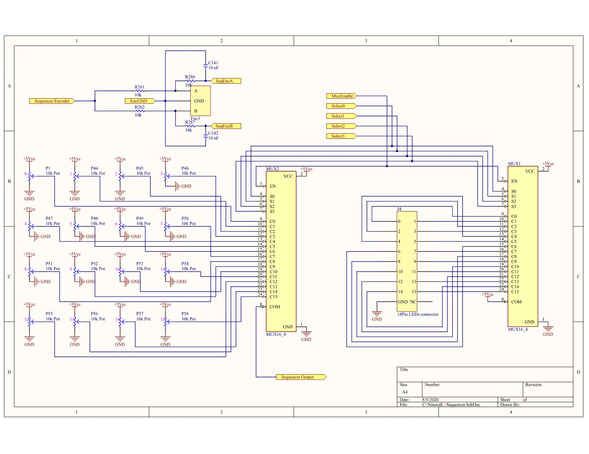
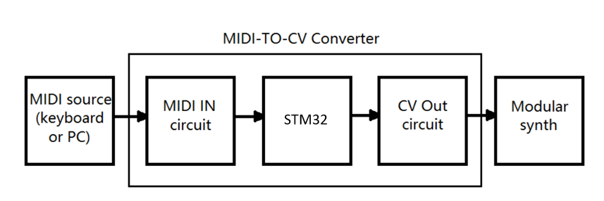

# Hybrid-Synthesizer
University’s Final project 

## Table of contents
* [Inspiration](#inspiration)
* [Motivation](#motivation)
* [Block Diagram](#block-diagram)
* [Clock Generator](#clock-generator)
* [Step Sequencer](#step-sequencer)
* [MIDI2CV](#midi2cv)

## Inspiration
As electronic music industry grows, and the warm analog sound returns to the forefront, the Hybrid Musical Monophonic Synthesizer offers a full analog signal path and a digital precise tempo control, periodic sequences generation and MIDI notes conversion. The synth consists two audio VCOs. The frequency of the VCOs is controlled in two ways: MIDI Keyboard or Step Sequencer. The VCOs signals are summed , shaped by a 4-poles filter and amplified.  In addition,  there are three LFOs (in order to generate periodic signals) and two EGs (to generate shaped pulses)  to control a variety of parameters of the synth.

## Motivation
The synth consists two main parts; digital and analog, when this project focuses only on the digital part. The core of my hybrid musical monophonic synthesizer is the [STM32F411RE Nucleo board](https://os.mbed.com/platforms/ST-Nucleo-F411RE/). This tutorial provide information how to design:
* Clock Generator - open the EG to produce shaped pulses and turn on the sequencer.
*	Step Sequencer - generates up to 16 different DC analog signals (triggered by the clock) which control the frequency of the oscillators to play notes.
* MIDI2CV - convert MIDI messages to control voltage signals.

## Block Diagram

## Clock Generator
In musical terminology tempo is the speed or pace of a given piece and it is measured in beats per minute (BPM). Since we want to enable the user to control the tempo, the clock generator consists of hardware components which allows the user to set the frequency continuously in one hand and discrete on the other hand. It is important to display the BPM of the clock while playing in order to provide the user the current tempo. The clock display includes not only hardware circuit but also C code which coordinates the program to the clock circuit. 
### Clock Generator scheme
.
### Clock Hardware
* Two [Rotary Encoder](https://howtomechatronics.com/tutorials/arduino/rotary-encoder-works-use-arduino/).
* [7- segments display](https://www.electronics-tutorials.ws/blog/7-segment-display-tutorial.html).
* Two NPN transistors in a row.
### Clock implementation
The rotary Encoders used as BPM selection: one to set the BPM value and one for mult/ div the frequency. Since the clock generates pulses in 60 bpm (1 Hz) up to 200 bpm (3.3 Hz) it is enough to use 7- segments display with three digits only. The use of the NPN transistors is for amplify the amplitude of the clock from 3.3 Volt output to 5 Volt with the same phase.   
### Clock software
- [7- segments display](https://www.electronics-tutorials.ws/blog/7-segment-display-tutorial.html) implementation- 
 each digit is illuminated just 1/3 of the time, but because the eye cannot perceive the darkening of a digit before it is illuminated again, the digit appears continuously illuminated. For each of the three digits to appear bright and continuously illuminated, all three digits should be driven at least once every 9 ms. Thus the entire display would be refreshed once every 9 ms and each digit would be illuminated for 1/3 of the refresh cycle (or 3 ms). Since the [STM32F411RE Nucleo board](https://os.mbed.com/platforms/ST-Nucleo-F411RE/) system clock frequency is 100 MHz, using the prescaler and the period of TIM2 we can control the frequency of the timer inttrupt and count the number of calls of the 7- segments functions. 
- [Rotary Encoder](https://howtomechatronics.com/tutorials/arduino/rotary-encoder-works-use-arduino/) implementation- the hardware of the [STM32F411RE Nucleo board](https://os.mbed.com/platforms/ST-Nucleo-F411RE/) timer in encoder mode provides a complete hardware solution for detecting signals and deciding the direction of counting up or down which significantly ease the process of firmware development for interfacing this kind of sensors. The following [tutorial](https://deepbluembedded.com/stm32-timer-encoder-mode-stm32-rotary-encoder-interfacing/) discuss the STM32 Timer encoder mode. src
## Step Sequencer
the step sequencer is a state machine with 1-16 states, where each state is a DC analog voltage level of 0-5 Volt. The voltage level determines the frequency of the VCOs and the rate (tempo) of switching states determined by the clock. The output signal can be seen in the following image:

.

We can see periodic signal with 8 diffrent levels and 10 DC analog signals. Each voltage level determines the basic VCOs frequency.    
### Step Sequencer implementation
I connected 16 potentiometers to [decoder 16:4](https://assets.nexperia.com/documents/data-sheet/74HC_HCT4514.pdf) and the four selcteor pins to the microcontroller (update the output using timer 2 interrupt). Using the Encoder i can decide how many steps(notes) to play.  
### Step Sequencer scheme
.

## MIDI2CV
[MIDI](http://web.archive.org/web/20070820161159/http://www.borg.com/~jglatt/tech/midispec.htm) is a digital protocol which allows synthesisers and computers to talk to each other, and CV means control voltage. There are various different means by which synthesisers can “talk” to each other and one of the most common is the CV. Using two control signals: one to define the pitch of the note and the other to say whether the note should be playing or not, we can determine the VCOs frequency in the same way the sequqncer does. 
### MIDI2CV scheme
.

### MIDI2CV motivation
MIDI-to-CV includes three main issues:
* [MIDI to UART](#midi-to-uart)- converts thr MIDI message to UART.
* [UART to PWM](#uart-to-pwm)- converts the data to PWM signal.
* [PWM to CV](#pwm-to-cv)- LPF to convert the PWM to CV.

#### MIDI to UART

The MIDI protocol shares many similarities with standard asynchronous serial interfaces, so i could use the UART pins of my STM32 to send and receive MIDI's event messages. In the [MIDI Tutorial](https://learn.sparkfun.com/tutorials/midi-tutorial/hardware--electronic-implementation) you can find all the information you need to know about MIDI protocol and MIDI-IN circuit. MIDI uses a clock rate of 31,250 bits per second. To send an 8-bit byte, it needs to be bookended with start and stop bits, making ten bits total. That means a byte takes about 320 microseconds to send, and the maximum throughout on a MIDI connection is 3,125 bytes per second. The average MIDI message is three bytes long, taking roughly one millisecond to transmit. The sparkFun MIDI Shield sends the signal to UART RX pin of my STM32, thus the microcontroller gets every 320 microseconds another byte.

#### UART to PWM
Briefly, MIDI uses bytes to convey a wide array of musical information. My synth is monophonic(playing only one note at once), thus, I was only interested in a few messages:

* note On/Off (pressing a key message) = 0x90/0x80.
* pitch (what key I am pressing message) = 0x00- 0x7F.
* velocity (how hard I am pressing the key message) = 0x00- 0x7F.
CV conveys the same information as MIDI but does it differently, using both analog and logic-level signals. MIDI note on/off or pitch note messages map to logic-level GATE and TRIGGER CV signals. Each pitch gets a specific duty cycle so it will sounds most similar to the original note.

#### PWM to CV
 For converting the STM's digital output to analog CV signals I am using filtered PWM. 

