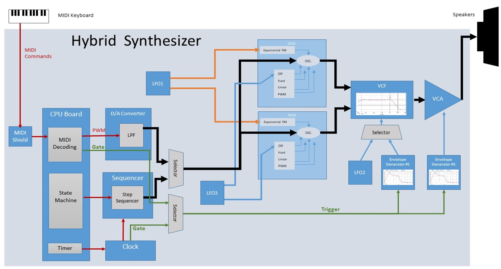
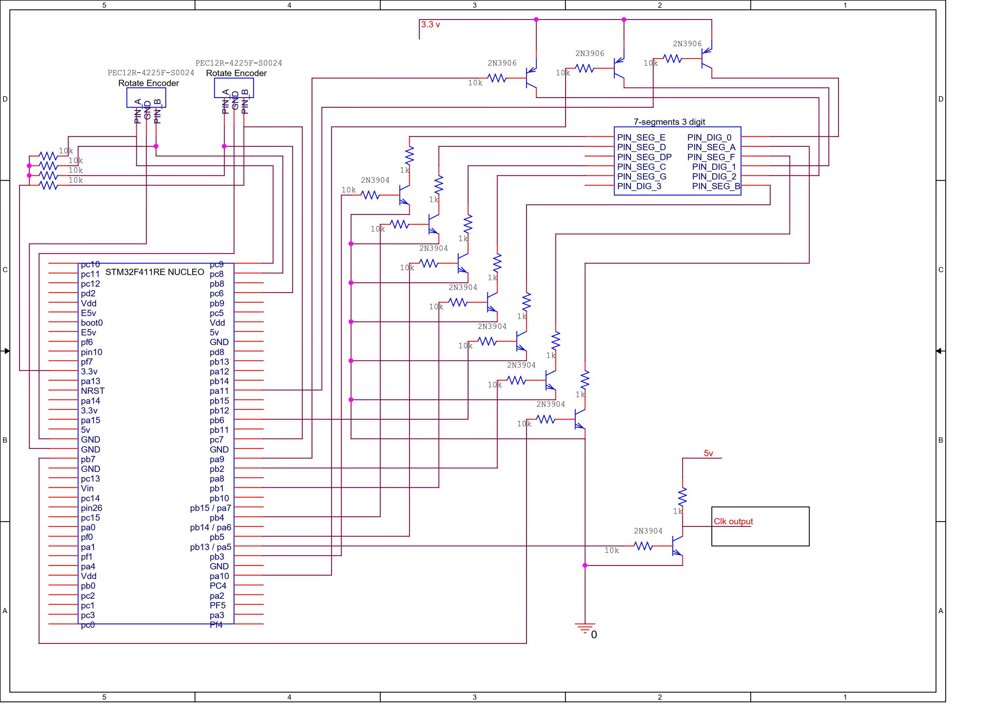
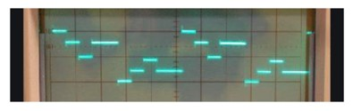

# Hybrid-Synthesizer
University’s Final project 

## Table of contents
* [Inspiration](#inspiration)
* [Motivation](#motivation)
* [Block Diagram](#block-diagram)
* [Clock Generator](#clock-generator)
* [Step Sequencer](#step-sequencer)
* [MIDI2CV](#midi2cv)

## Inspiration
As electronic music industry grows, and the warm analog sound returns to the forefront, the Hybrid Musical Monophonic Synthesizer offers a full analog signal path and a digital precise tempo control, periodic sequences generation and MIDI notes conversion. The synth consists two audio VCOs. The frequency of the VCOs is controlled in two ways: MIDI Keyboard or Step Sequencer. The VCOs signals are summed , shaped by a 4-poles filter and amplified.  In addition,  there are three LFOs (in order to generate periodic signals) and two EGs (to generate shaped pulses)  to control a variety of parameters of the synth.

## Motivation
The synth consists two main parts; digital and analog, when this project focuses only on the digital part. The core of my hybrid musical monophonic synthesizer is the [STM32F411RE Nucleo board](https://os.mbed.com/platforms/ST-Nucleo-F411RE/). This tutorial provide information how to design:
* Clock Generator - open the EG to produce shaped pulses and turn on the sequencer.
*	Step Sequencer - generates up to 16 different DC analog signals (triggered by the clock) which control the frequency of the oscillators to play notes.
* MIDI2CV - convert MIDI messages to control voltage signals.

## Block Diagram

## Clock Generator
In musical terminology tempo is the speed or pace of a given piece and it is measured in beats per minute (BPM). Since we want to enable the user to control the tempo, the clock generator consists of hardware components which allows the user to set the frequency continuously in one hand and discrete on the other hand. It is important to display the BPM of the clock while playing in order to provide the user the current tempo. The clock display includes not only hardware circuit but also C code which coordinates the program to the clock circuit. 
### Clock Generator diagram
.
### Clock Hardware
* Two [Rotary Encoder](https://howtomechatronics.com/tutorials/arduino/rotary-encoder-works-use-arduino/).
* [7- segments display](https://www.electronics-tutorials.ws/blog/7-segment-display-tutorial.html).
* Two NPN transistors in a row.
### Clock implementation
The rotary Encoders used as BPM selection: one to set the BPM value and one for mult/ div the frequency. Since the clock generates pulses in 60 bpm (1 Hz) up to 200 bpm (3.3 Hz) it is enough to use 7- segments display with three digits only. The use of the NPN transistors is for amplify the amplitude of the clock from 3.3 Volt output to 5 Volt with the same phase.   
### Clock software
- [7- segments display](https://www.electronics-tutorials.ws/blog/7-segment-display-tutorial.html) implementation- 
 each digit is illuminated just 1/3 of the time, but because the eye cannot perceive the darkening of a digit before it is illuminated again, the digit appears continuously illuminated. For each of the three digits to appear bright and continuously illuminated, all three digits should be driven at least once every 9 ms. Thus the entire display would be refreshed once every 9 ms and each digit would be illuminated for 1/3 of the refresh cycle (or 3 ms). Since the [STM32F411RE Nucleo board](https://os.mbed.com/platforms/ST-Nucleo-F411RE/) system clock frequency is 100 MHz, using the prescaler and the period of TIM2 we can control the frequency of the timer inttrupt and count the number of calls of the 7- segments functions. 
- [Rotary Encoder](https://howtomechatronics.com/tutorials/arduino/rotary-encoder-works-use-arduino/) implementation- the hardware of the [STM32F411RE Nucleo board](https://os.mbed.com/platforms/ST-Nucleo-F411RE/) timer in encoder mode provides a complete hardware solution for detecting signals and deciding the direction of counting up or down which significantly ease the process of firmware development for interfacing this kind of sensors. The following [tutorial](https://deepbluembedded.com/stm32-timer-encoder-mode-stm32-rotary-encoder-interfacing/) discuss the STM32 Timer encoder mode. src
## Step Sequencer
the step sequencer is a state machine with 1-16 states, where each state is a DC analog voltage level of 0-5 Volt. The voltage level determines the frequency of the VCOs and the rate (tempo) of switching states determined by the clock. The output signal can be seen in the following image:

.

### Step Sequencer implementation
I connected 16 potentiometers to [decoder 16:4](https://assets.nexperia.com/documents/data-sheet/74HC_HCT4514.pdf) and the four selcteor pins to the microcontroller (update the output using timer 2 interrupt). Using the Encoder i can decide how many steps(notes) to play.  

